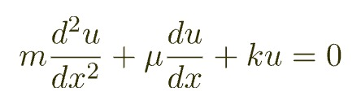
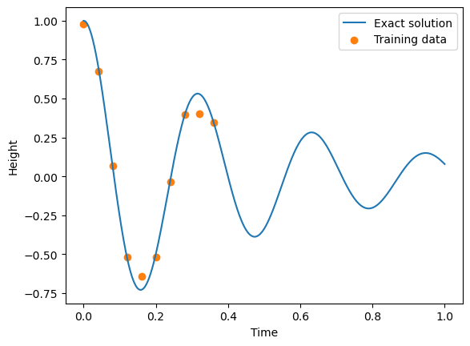
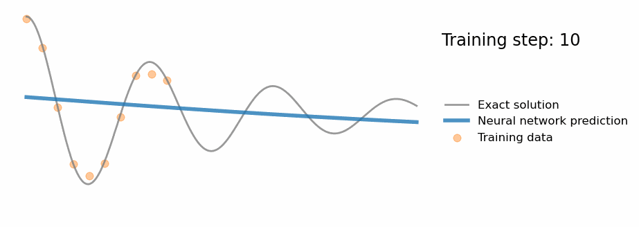
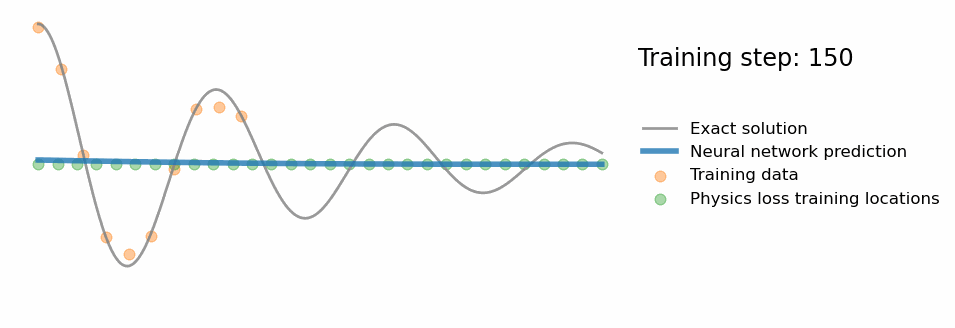

# 为什么我们需要将机器学习与电化学模型结合

传统机器学习方法仅依赖于数据，这意味着数据的**数量**和**质量**将会对机器学习模行性能产生极大的影响。而在现如今的AI市场，**数据数量**的重要性更是远超**数据质量**：使用大量数据和极长的模型训练时间来*大力出奇迹*的例子比比皆是，例如现在爆火的对话模型ChatGPT和图像生成模型Stable-Diffusion背后都离不开*TB*级数据的支持。

相比之下，在电池行业，我们能获得的电芯数据量是极为有限的，因为测试电芯需要专业的场地，设备，以及人力和时间成本。在这种情况下，为了能够获得高精度的机器学习模型，有两条路可以选择：
1. 通过已有的电芯数据生成新的电芯数据，增加数据量
2. 用我们对电芯已有的认知来辅助机器学习模型，以此弥补数据量的不足

对于第一个方案，我们需要保证生成的电芯数据尽可能的符合真实情况，这一点比较难以实现（或者只能生成少量的数据）。所以我们决定使用第二个方案：将机器学习与已有的电芯知识进行结合。通过这个**结合**，我们希望对电池容量预测模型进行以下提升：
1. 模型可以对其没有见过的电芯数据做出相对合理的判断
2. 模型可以尽可能少地受到数据中存在的噪音的影响
3. 模型可以用极少量的训练数据达到合理的预测精度

我们认为这个将机器学习模型与电芯知识的结合是可以实现的，因为在其他领域已经有很多先例。下面我们将用物理学中的一个例子来说明**两者的结合**将如何带来上述**三点好处**。

上图为物理学中非常经典的弹簧系统，其运动规律可以通过以下微分方程来解释：

其中u表示绿色方块的高度（因变量），x表示时间（自变量）。m，$\mu$，k为三个常数，分别代表绿色方块质量，空气摩擦系数及弹簧系数。现在假设我们想要通过对弹簧系统进行观测来预测弹簧在任意时间点的高度，但是我们的观测存在误差：

上图中蓝线为我们想获得的弹簧实际运行轨迹，而黄色点为我们在固定时间对弹簧高度的观测(有误差)。如果我们不知道弹簧的运动轨迹遵从于弹簧系统的微分方程，而单纯用传统机器学习(完全依赖观测数据)的方式去对弹簧的运动轨迹进行预测，我们将会获得如下结果：

如图所示，蓝色线为模型的预测。我们可以发现机器学习模型可以在有观测数据的部分给出比较准确的判断，但是对于没有观测数据的后半段曲线模型的误差极大。另一个发现是模型完全遵从黄色的观测点，即使这个观测点是存在误差的：例如从左往右数的第五个观测点和第九个观测点的误差较大，导致模型在这些时间段的预测不准确。相对的，通过Physics Informed Neural Network (PINN), 我们可以将微分方程的信息融入到模型的训练中，从而获得以下预测：

可以发现，虽然输入模型的观测点是一致的，但是因为融入了物理学规律(微分方程)，模型可以在其没有观测数据的部分给出较为准确的判断。同时对于第五个观测点和第九个观测点，模型并没有给出和观测结果一至的预测，而是意识到了观测中存在的错误，并对其加以更正。(P.S. 在结合微分方程时，模型并不知道其参数(m，$\mu$，k)。 而在模型训练结束后，这三个参数可以从由模型参数获得)